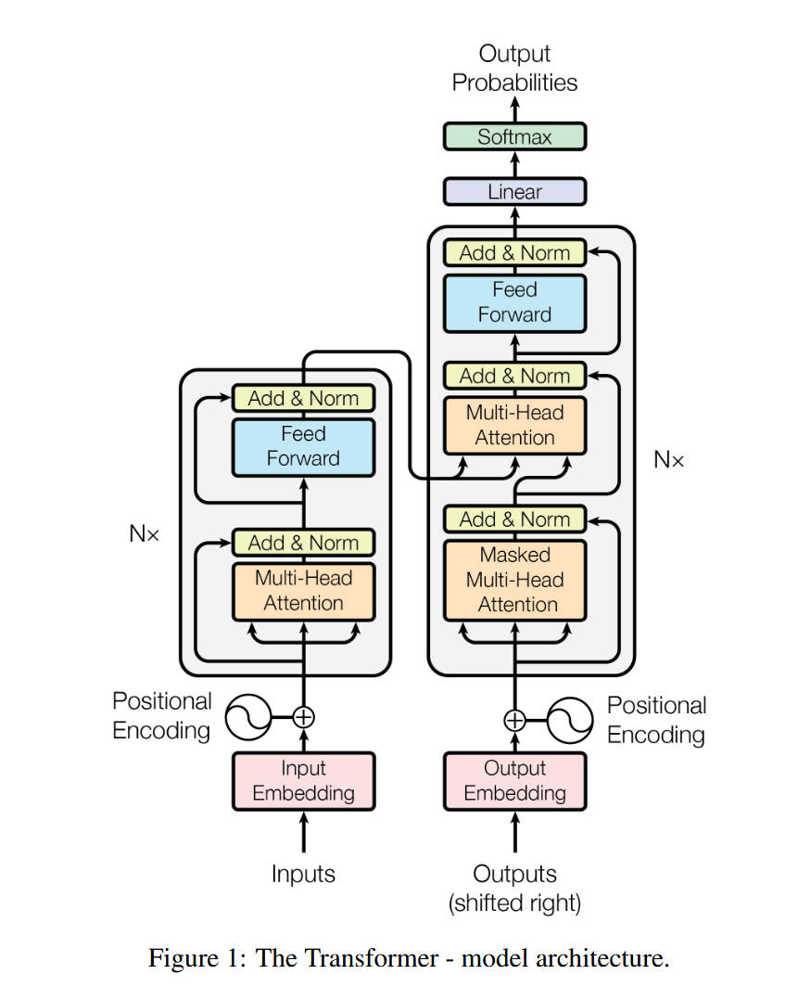
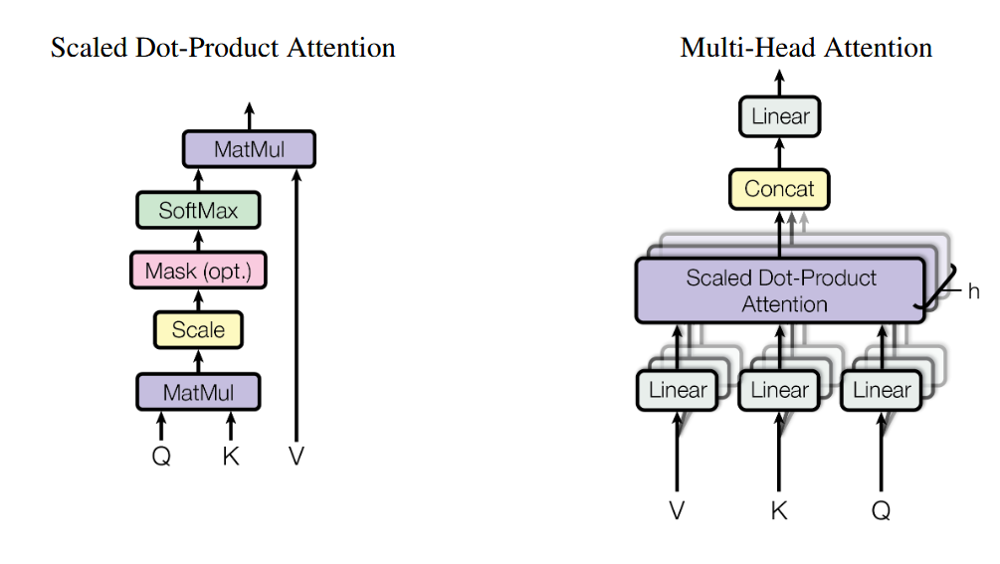

# Something about Transformer
## Encoder VS Decoder
> * Encoder（编码器）的输出 = 教科书/参考资料（源句子，比如 "I love SLAM"）。
> * Decoder（解码器）的输入 = 你的答题纸（你目前已经写下的翻译结果，比如 "我", "爱"）。
## Basic 
### What is Transformer: 

  

由 

$$
Encoding \rightarrow Decoding \rightarrow Linear \rightarrow Softmax
$$ 

四部分构成的，其中最重要的就是编码部分(Encoding)和解码部分(Encoding)，因为后期的全连接层和Softmax层和神经网络是一样的，只是解决一个简单的分类问题。
### What is Encoder:
编码部分是由多个编码器构成,这些编码器的结构如下:

$$
Multi-Head-Attention \rightarrow 残差相加层 \rightarrow 前馈网络Feed-Forward \rightarrow 残差相加层
$$

* 其中最重要的就是这些**多头自注意力机制**，所谓多头自注意力机制其实就是**多个并行的自注意力机制(self-attention)**。公式如下：

$$
\begin{aligned}
\text{MultiHead}(Q, K, V) &= \text{Concat}(\text{head}_1, \dots, \text{head}_h)W^O \\
\text{where } \text{head}_i &= \text{Attention}(QW_i^Q, KW_i^K, VW_i^V)
\end{aligned}
$$

* 每个自注意力机制中包含一组分别用于**计算Q、K、V矩阵的权重矩阵**。这些权重矩阵通过与输入（可能是最初的位置编码矩阵 + 输入嵌入矩阵，也可能是后面的前一个编码器的输出）进行**矩阵乘法**得到Q、K、V矩阵。其中**Q和K**进行矩阵相乘用于计算**输入内相关性**，随后对得分进行一些操作，最后再和V矩阵相乘得到了**输入每一个词相对于这个词之间的重要性关系**。公式如下所示：

$$
\text{Attention}(Q, K, V) = \text{softmax}\left( \frac{QK^T}{\sqrt{d_k}} \right) V
$$

  

> 自注意力机制中Q、K、V矩阵其实就是对序列信息进行抓取并做加权和
### What is Decoder:
解码器其实结构与编码器类似:

$$
Multi-Head-Attention \rightarrow 残差相加层 \rightarrow Encoding-Decoding Attention \\\rightarrow 残差相加层\rightarrow 前馈网络Feed-Forward \rightarrow 残差相加层
$$
* 只不过多了一个 Encoding-Decoding Attention层，这一层中也有Q、K、V三个矩阵，其中的**K与V来自于编码部分最后一个编码器中多头自注意力机制输出的K和V**，**Q来自 Decoder 自身上一层 Masked Self-Attention 层经过 Add & Norm 后的输出**。
* 此外在解码器中由于词是一个一个输出的所以多头自注意力机制不能够读到后面的内容，需要一个Mask操作。

### What is Positional Encoding:
在Transformer中我们需要对Input进行如下操作： 
$$
Input = Embedding(Word) + PositionalEncoding(Position)
$$
> 为什么是相加而不是拼接（Concat）？
> 其实拼接也可以，但相加不改变维度，省参数。而且数学上证明，在高维空间里，相加近似于把位置信息“烙印”在语义信息上，网络能学会把它们拆开。
其中位置编码的公式如下：
  
$$
PE(pos, 2i) = \sin(\frac{pos}{10000^{\frac{2i}{d_{model}}}})
$$
  
$$
PE(pos, 2i+1) = \cos(\frac{pos}{10000^{\frac{2i}{d_{model}}}})
$$

> 为什么要用三角函数？
> Transformer 用不同频率的 sin/cos 波形组合，给每个位置生成了一个独一无二的指纹（纹理）
> 此外由于和角公式：

$$
  \sin(\alpha + \beta) = \sin\alpha \cos\beta + \cos\alpha \sin\beta
$$
> 位置 $pos+k$ 的编码，可以被 位置 $pos$ 的编码线性表示，即网络只需要学习一个线性变换矩阵，就能轻松算出“相对位置”（比如：A 在 B 后面第 3 个位置）。

---
## 鄙人的一点感悟
1. Transformer本身是一种包含注意力机制的网络架构，也就是说其和CNN或者RNN的地位是一样的。它现在被称为 Foundation Model（基础模型）。在CV中，CNN（如 ResNet）擅长提取局部特征（纹理、边缘），而 Transformer 擅长提取全局特征（物体间的空间关系、语义关联）。这就是为什么 VGGT 能做 Pose Estimation：因为它能“看”到整张图的几何关系，而不是只盯着某个角点。

2. Transformer不同于RNN，它可以一次性整个输入都读进去，至于怎么寻找这些输入内容之间的关系，是多头自注意力机制的事：每个自注意力机制都通过计算Q和K矩阵的乘法从全部输入（整个向量构成的矩阵）中找到与当前词（向量）关系最为密切的那个词（向量），并令其获得最高的score，将这个score作用到V矩阵上从而推动注意力机制寻找句内关系。
关键词是 Permutation Invariant（排列不变性）。如果把输入的词打乱顺序，Self-Attention 算出来的结果是一模一样的

3. 整个Transformer模型分为编码器和解码器两大部分，其中编码部分的结果会直接传给解码部分中编码解码多头注意力机制的K和V，而编码解码多头注意力机制的Q则来自于前面多头自注意力机制的输出。这个将编码和解码联系起来的编码解码多头注意力机制其实就起到了在处理翻译任务过程中同时关注句内关系的作用。在 VGGT 里，这对应着：Encoder 出图特征，Decoder 出几何参数。几何参数（Q）去图特征（K, V）里找线索。

4. 在李沐的讲解视频中有关多头注意力机制的部分其提到将Q、K、V三个矩阵分配给多头注意力机制的过程中涉及到一个投影变换，这个投影过程的参数是可以学习的。我的理解是设置多头注意力机制就是为了解决单头效果可能出现不准的问题，人多力量大嘛，最后的结果通过大家Concat一起来决定。

5. 解码器的输入是前面一刻解码器的输出，这也就意味着Transformer在推理时的输出是一个一个来的。但是在训练时，因为我们已经知道正确答案（Ground Truth），我们可以把整句话一次性喂给 Decoder，但是用 Mask（掩码） 遮住未来的词，强迫它只能看前面的。所以训练是并行的，推理是串行的。

6. 为什么在残差结构中使用LayerNorm而不是BatchNorm? 因为LayerNorm更有利于在NLP的过程中的稳定性。BatchNorm 依赖 Batch 的统计量（均值方差），NLP 的句子长短不一，Batch 统计量抖动很大。LayerNorm 是“自己对自己做归一化”，不依赖别人，所以稳。

7. Position-wise Feed-Forward Networks就是一个三层感知机 输入层512 中间层2048 输出层 512。

